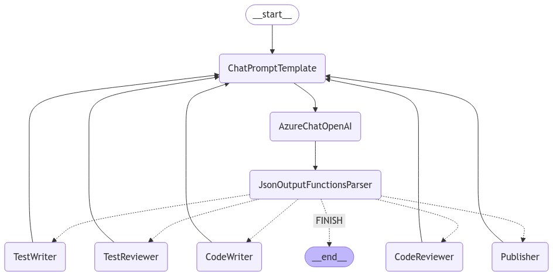
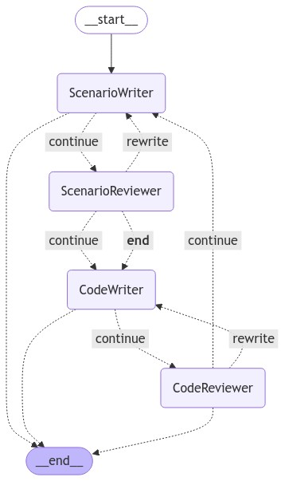

# Многоагентные архитектуры с Langchain

Этот проект исследует несколько многоагентных архитектур с использованием Langchain (LangGraph), акцентируя внимание на сотрудничестве агентов для решения сложных задач. Я реализую и сравниваю три основные архитектуры:
- **Планирование и выполнение**,
- **Многоагентный супервизор**
- **Многоагентное сотрудничество**.

Каждая из этих архитектур имеет свои уникальные преимущества в зависимости от сложности задачи, будь то простое отвечание на вопросы или генерация кода и тестовых сценариев на нескольких языках программирования.

## Используемые технологии
- Python 3.10
- Langchain
- Tavily API (необязательно, можно заменить на DuckDuckGo API)
- Языковые модели (можно использовать любые, поддерживаемые Langchain, например, модели GPT. Я использовал AzureOpenAI)

## Обзор архитектур

### 1. Планирование и выполнение

Эта архитектура включает в себя одного агента, который принимает ввод пользователя, планирует действия на основе вопроса и выполняет серию шагов для предоставления ответа. Она идеально подходит для простых, четко определенных задач, таких как процесс вопросов и ответов или легкое планирование.


#### Пример использования: Планирование поездки в Пекин
- **Ввод:** "Какие 5 мест я должен посетить?"
- **План:** Агент составляет план исследования популярных туристических мест в Пекине.
- **Выполнение:** Агент находит и ранжирует 5 лучших мест для посещения в Пекине, представляя результат.

Эта архитектура подчеркивает четкое разделение задач, где один агент может следовать заранее определенным шагам до завершения.

### 2. Многоагентный супервизор

В этой архитектуре несколько агентов используются для обработки различных аспектов сложной задачи. **Супервизор-агент** контролирует распределение задач и обеспечивает, чтобы каждый агент работал независимо, но в координации. Эта модель полезна при генерации разнообразных выходов, требующих проверки и редактирования.



#### Пример использования: Генерация кода с редактированием
- **Цель:** "Создайте скрипт на Python для вычисления чисел Фибоначчи, версию того же алгоритма на JavaScript, а затем проверьте оба на предмет оптимизации."
- **Супервизор:** Назначает задачи агенту Python и агенту JavaScript для генерации кода.
- **Агенты:**
  - **Агент Python:** Создает версию на Python.
  - **Агент JavaScript:** Создает версию на JavaScript.
- **Агенты-редакторы:** Специализированные агенты для Python и JavaScript проверяют код на корректность и оптимизацию.
- **Супервизор:** Собирает и консолидирует окончательный проверенный код.

Эта архитектура подходит для задач, требующих координации между этапами создания и редактирования, с акцентом на контроль качества.

### 3. Многоагентное сотрудничество

Архитектура сотрудничества подчеркивает взаимодействие агентов в реальном времени для более целостного решения задачи. Агенты обмениваются информацией и коллективно работают над одной и той же задачей, итеративно улучшая работу друг друга. Эта модель идеально подходит для сценариев, где задача более гибкая и требует творческого вклада с разных точек зрения.



#### Пример использования: Сложное программирование с генерацией тестовых сценариев
- **Цель:** "Создайте программу на C# для вычисления умножения матриц и также создайте тестовые сценарии для кода."
- **Агенты:**
  - **Агент-генератор кода на C#:** Пишет начальную программу умножения матриц.
  - **Агент тестовых сценариев:** Генерирует тестовые сценарии для программы умножения матриц.
  - **Агент-редактор кода на C#:** Проверяет сгенерированный код и тесты.
- **Сотрудничество:** Агенты обмениваются результатами, улучшая как код, так и тестовые случаи итеративно, с частым общением между агентами для уточнения решения.

Эта архитектура лучше всего подходит для задач, требующих непрерывного взаимодействия и итераций для достижения оптимального решения.

## Как запустить проект

1. Клонируйте репозиторий:
```bash
   git clone https://github.com/yourusername/multi-agent-langchain.git
   cd multi-agent-langchain
```

2. Настройте свою среду:
```bash
    python3 -m venv venv
    source venv
    pip install -r requirements.txt
```